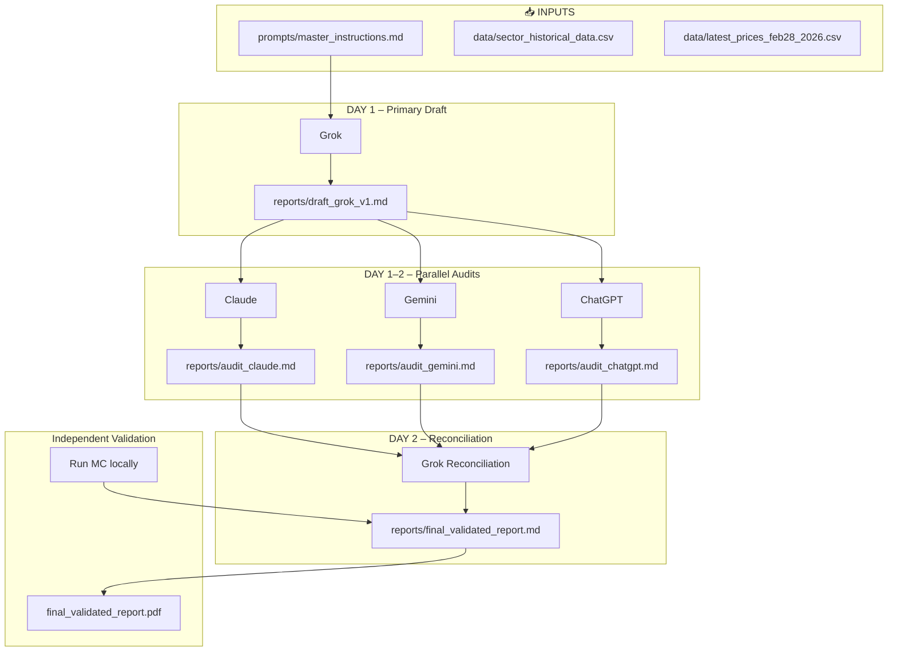

# Repository Diagram

## Workflow Overview



## Directory Structure

```
geopolitical-investment-research-2026/
├── prompts/
│   ├── master_instructions.md     ← Copy-paste to all AIs
│   ├── grok_prompt_v1.md
│   ├── claude_audit_prompt.md
│   ├── gemini_audit_prompt.md
│   ├── chatgpt_audit_prompt.md
│   └── reconciliation_prompt.md
├── data/
│   ├── sector_historical_data.csv
│   └── latest_prices_feb28_2026.csv
├── code/
│   ├── monte_carlo_simulator.py   ← 3 scenarios A/B/C
│   ├── run_simulations.sh
│   ├── run_mc.ps1
│   ├── commit_audit_round.ps1
│   └── export_to_pdf.ps1
├── reports/
│   ├── draft_grok_v1.md
│   ├── audit_claude.md
│   ├── audit_gemini.md
│   ├── audit_chatgpt.md
│   ├── final_validated_report.md  ← TARGET OUTPUT
│   └── mc_summary.csv
├── audits/feedback_round1/
├── REPO_DIAGRAM.md
├── CURSOR_ORCHESTRATION.md
├── README.md
└── requirements.txt
```

## One-Click Scripts

| Action | Command |
|--------|---------|
| Run Monte Carlo | `.\code\run_mc.ps1` |
| Commit audit | `.\code\commit_audit_round.ps1 -Message "Round N"` |
| Export PDF | `.\code\export_to_pdf.ps1` |
