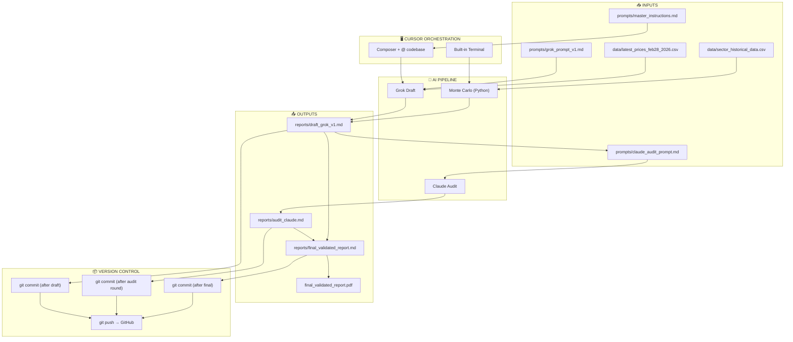

# Repository Diagram

## Workflow Overview



## Directory Structure

```
geopolitical-investment-research-2026/
├── prompts/
│   ├── master_instructions.md     ← Canonical instructions
│   ├── grok_prompt_v1.md          ← Grok analysis prompt
│   └── claude_audit_prompt.md     ← Audit prompt
├── data/
│   ├── sector_historical_data.csv
│   └── latest_prices_feb28_2026.csv
├── code/
│   ├── monte_carlo_simulator.py   ← Run via one-click script
│   ├── run_simulations.sh         ← Unix/WSL/Git Bash
│   ├── run_mc.ps1                ← Windows one-click
│   ├── commit_audit_round.ps1    ← Version control helper
│   └── export_to_pdf.ps1         ← Markdown → PDF
├── reports/
│   ├── draft_grok_v1.md
│   ├── audit_claude.md
│   └── final_validated_report.md  ← TARGET OUTPUT
├── audits/
│   └── feedback_round1/
├── REPO_DIAGRAM.md               ← This file
├── CURSOR_ORCHESTRATION.md       ← Step-by-step instructions
├── README.md
└── requirements.txt
```

## One-Click Scripts Map

| Action              | Script / Command                              |
|---------------------|-----------------------------------------------|
| Run Monte Carlo     | `.\code\run_mc.ps1` (or `python code\monte_carlo_simulator.py ...`) |
| Commit audit round  | `.\code\commit_audit_round.ps1 -Message "Round N"` |
| Export to PDF       | `.\code\export_to_pdf.ps1` (requires Pandoc; else use Cursor preview → Print) |
